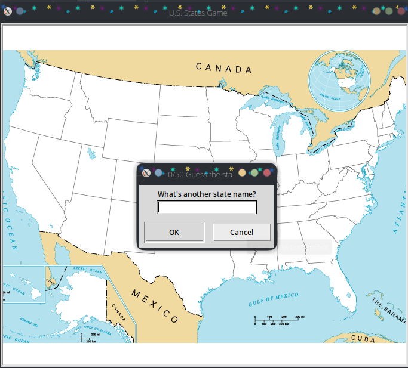

# US_Map_Guess_Game
<table>
<tr>
  <td>
    
  </td>
  <td>
    Run main.py and start playing the game. If user inputs 'exit' when prompted to write state name, the screen closes.
  </td>
</tr>
</table>
